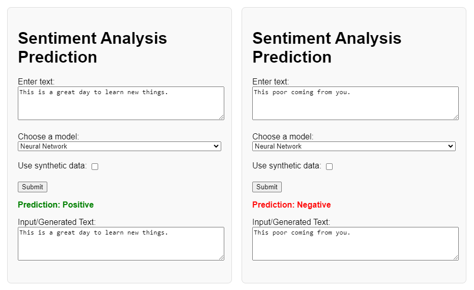
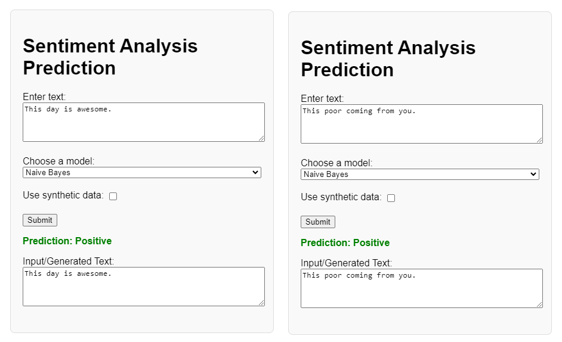
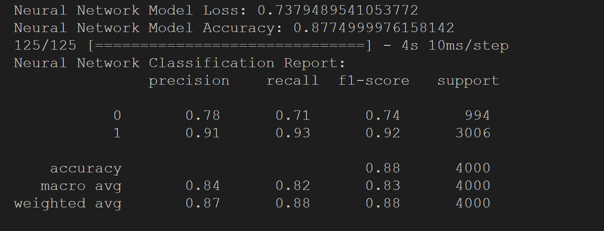
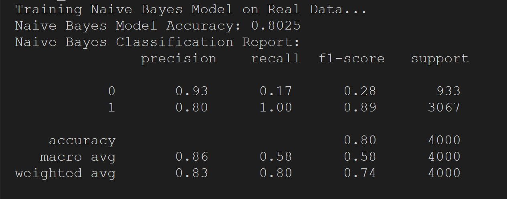
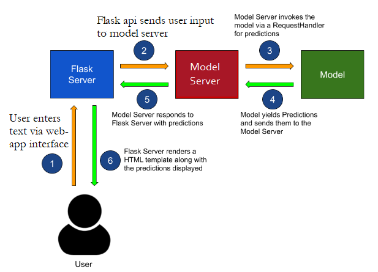

[][def]

# Individual Project IV - A publicly accessible auto-scaling container using Azure App Services and Flask.

## Project Scope

As digital platforms burgeon with user-generated content, the ability to gauge public sentiment through this data has become invaluable for businesses and researchers alike. Sentiment analysis, a cornerstone of Natural Language Processing (NLP), seeks to systematically identify, extract, and quantify the affective states and subjective information embedded within text data. Despite its potential, sentiment analysis poses inherent challenges, such as detecting nuances, sarcasm, and context-specific meanings, which often elude traditional analytical tools.

This project contributes to the field by developing a sophisticated sentiment classification system trained on an extensive corpus of Amazon user reviews. The focus is to discern positive and negative sentiments, thereby providing granular insights into consumer opinions. In aligning with ethical data use, the acquisition of the 20,000-user review dataset was conducted in strict adherence to the platform's terms of service, ensuring respect for user privacy.

The project employed two distinct models for sentiment classification:
* Naive Bayes Classifier: Renowned for its simplicity and efficiency in text classification, this generative model assumes the independence of features and is computationally expedient.
* Neural Network: Selected for its prowess in discerning intricate patterns, this discriminative model comprised an input layer, two hidden layers with 64 nodes each employing ReLU activation functions, and a sigmoid output layer to achieve binary classification.

## Project Deliverables:

[A Flask API](https://github.com/nogibjj/oo46_iProject_4/blob/main/myapp/api/sentiment_predictor.py) That serves as the user entry point to the application. => Python myapp/api/sentiment_predictor.py

The project employed two distinct models for sentiment classification:
•	Naive Bayes Classifier: Renowned for its simplicity and efficiency in text classification, this generative model assumes the independence of features and is computationally expedient.
•	Neural Network: Selected for its prowess in discerning intricate patterns, this discriminative model comprised an input layer, two hidden layers with 64 nodes each employing ReLU activation functions, and a sigmoid output layer to achieve binary classification.

When subjected to real-world user input (as shown above), the Neural Network model maintained a near-perfect precision in its predictions. This high level of accuracy in identifying both positive and negative sentiments reflects the robustness of the model, which was initially indicated by the training results. The consistency in performance from training to practical application underscores the model's capability to generalize well and handle the intricacies of user-generated content effectively.

Upon evaluation with real-world user input, the Naive Bayes model exhibited a decline in precision for the negative class (as shown above), echoing the tendencies observed earlier in the training phase. This disparity in performance, particularly for the negative sentiments, underlines the model's challenges in accurately classifying more nuanced expressions of dissatisfaction or criticism, as previously demonstrated by the training results.

### Model Training Pipeline

### Project Architecture

## Youtube Link

[Click Here](https://youtu.be/EclC035k0Sw)

[def]: https://https://github.com/nogibjj/oo46_Mini_Proj_W11/actions/workflows/actions.yml
